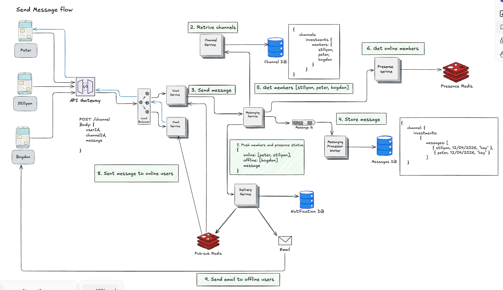
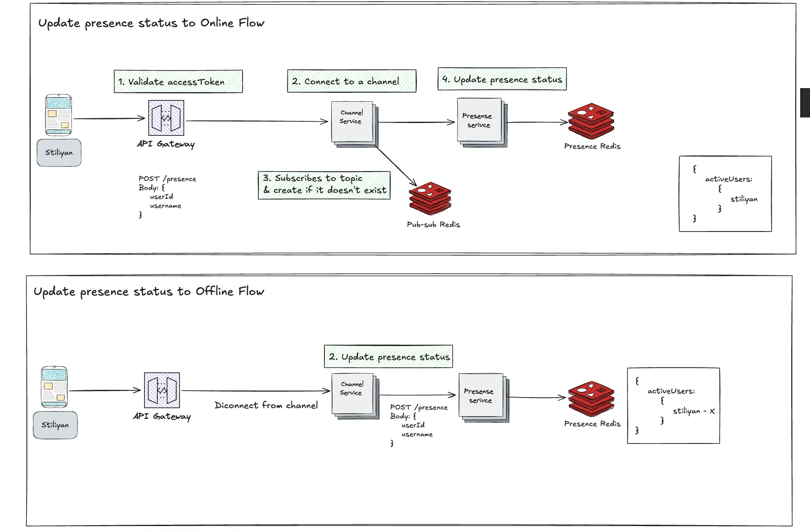
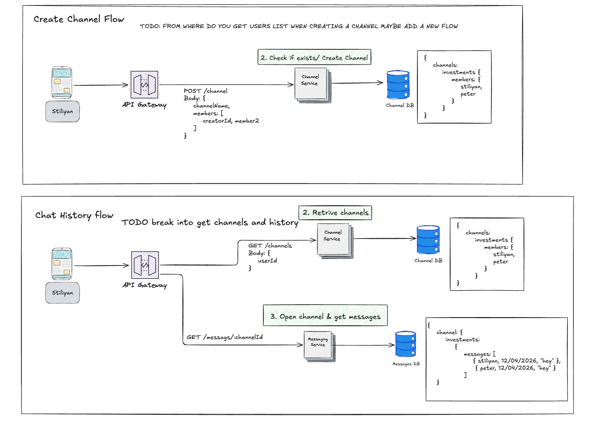
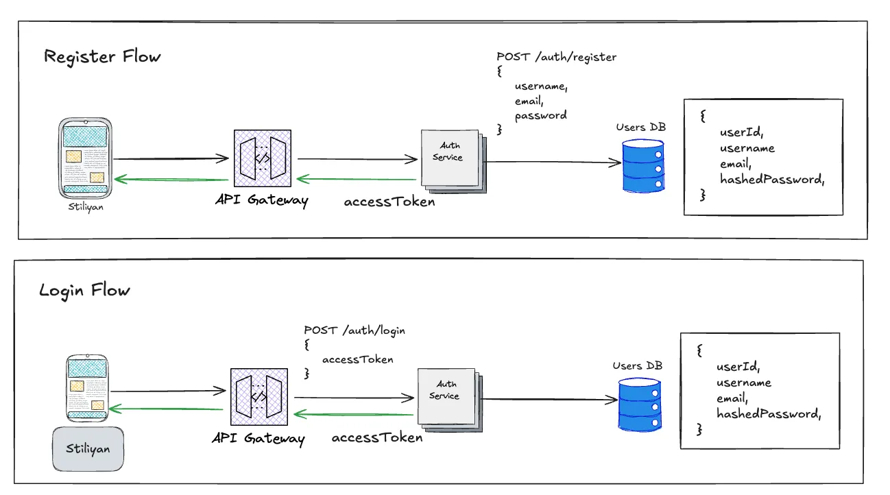

# Distributed Chat System - https://distributed-chat-system-five.vercel.app/

### Presentation link - https://docs.google.com/presentation/d/1olc3AiLWQG7WR66OBm8kXQMtrY73zIOA/edit?slide=id.p1#slide=id.p1

> A production-grade, real-time distributed chat platform built on a microservices architecture — event-driven messaging, dynamic Pub/Sub fan-out, multi-device presence with crash recovery, and polyglot persistence, fully containerized with Docker.

<p>
  
  
  
  
  
  
  
  
  
</p>

---

## Table of Contents

- [Overview](#overview)
- [Highlights](#highlights)
- [Tech Stack](#tech-stack)
- [Architecture Overview](#architecture-overview)
- [Services](#services)
- [Message Delivery Flow](#message-delivery-flow-end-to-end)
- [Key Architectural Decisions](#key-architectural-decisions)
- [Resilience & Crash Recovery](#resilience--crash-recovery)
- [Getting Started](#getting-started)
- [Project Structure](#project-structure)
- [Further Reading](#further-reading)

---

## Overview

This system models how large-scale chat platforms (Discord, Slack) move a message from a sender's keystroke to every recipient's screen — reliably, in order, and without losing a single message even when components fail. It is composed of **seven independent NestJS microservices** that communicate over a Docker network, coordinated through an **Apache Kafka** message pipeline and **Redis Pub/Sub** fan-out, with **Socket.IO** delivering messages to clients in real time.

The design favors **loose coupling** (services don't reach into each other's domains), **independent scalability** (HTTP ingestion and queue processing scale separately), and **end-to-end durability** (a message is safe the moment Kafka acknowledges it).

---

## Highlights

- **Event-driven message pipeline** — Kafka with partition-based ordering by `channelId` and idempotent, exactly-once-effective database writes.
- **Dynamic Pub/Sub subscription (Strategy C)** — Chat Service instances subscribe only to the channels they currently serve, combining broadcast simplicity with targeted-delivery efficiency.
- **Dual-process Messaging Service** — one codebase, two entry points (HTTP API + Kafka worker) that scale independently.
- **Multi-device presence with crash recovery** — atomic Lua scripts, per-user connection sets, and TTL heartbeats that self-heal stale state within seconds.
- **Resilient API Gateway** — JWT validation, header injection, plus circuit breaking, bulkhead isolation, and request throttling (200 req/min).
- **Polyglot persistence** — PostgreSQL for relational data, Redis for sub-millisecond presence and ephemeral fan-out.
- **Fully containerized** — every service, database, broker, and cache runs via Docker Compose on a shared network.

---

## Tech Stack

| Layer | Technology |
|-------|------------|
| **Runtime** | Node.js · NestJS · TypeScript |
| **Monorepo** | Nx |
| **Relational DB** | PostgreSQL (Auth, Channel, Messages) |
| **Cache / Real-time state** | Redis (Presence, Pub/Sub) |
| **Message broker** | Apache Kafka |
| **Real-time transport** | Socket.IO (WebSocket) |
| **Infrastructure** | Docker · Docker Compose |

---

## Architecture Overview






---

## Services

Clients interact with the system through exactly two surfaces: **REST via the API Gateway** and a **direct WebSocket connection to the Chat Service**. All other ports are exposed only for local development and debugging.

| Service | Local Port | Datastore | Responsibility |
|---------|:----------:|-----------|----------------|
| **API Gateway** | `3000` | — | Single REST entry point. JWT validation, routing, header injection (`x-user-id`, `x-username`), circuit breaker, bulkhead, throttling |
| **Chat Service** | `3080` | Redis Pub/Sub | WebSocket connections (Socket.IO), dynamic topic subscription, in-memory connection maps |
| **Auth Service** | `3002` | PostgreSQL | Registration, login (bcrypt), JWT generation with a shared signing secret |
| **Channel Service** | `3020` | PostgreSQL | Channel CRUD, membership management, member-list provider for other services |
| **Messaging Service** | `3003` | PostgreSQL + Kafka | Two entry points: `messaging-api` (HTTP) and `messaging-worker` (Kafka consumer / orchestrator) |
| **Presence Service** | `3004` | Redis | Online/offline tracking, atomic Lua multi-device connection tracking, TTL heartbeats |
| **Delivery Service** | `3005` | — | Receives constructed payloads, publishes to Redis Pub/Sub, and emails offline users |

> Tooling: **Kafka UI** is exposed on `8080` and **RedisInsight** on `8001` for inspecting the broker and caches during local runs.

---

## Message Delivery Flow (End-to-End)

```
1. Peter types "hey everyone" in the "investments" channel.
2. Client emits a WebSocket event → Chat Service.
3. Chat Service calls POST /messages on the Messaging API.
     → messaging-api validates input, generates messageId + timestamp,
       publishes to Kafka, and returns 202 Accepted immediately.
4. Chat Service sends { event: "message_sent", messageId } back to Peter (optimistic UI).
5. messaging-worker consumes the Kafka record:
     a. INSERT message into PostgreSQL (idempotent: ON CONFLICT (id) DO NOTHING)
     b. GET channel members  → [stiliyan, peter, bogdan]
     c. GET presence status   → { online: [stiliyan, peter], offline: [bogdan] }
     d. POST /delivery → Redis Pub/Sub fan-out to online users + email to bogdan
```

**Durability guarantee:** a message is safe from the moment Kafka acknowledges the publish. If the worker crashes before the DB write, Kafka redelivers (offset uncommitted); if it crashes after the write but before committing the offset, Kafka redelivers and the idempotent insert silently ignores the duplicate — giving exactly-once *effect* on top of at-least-once delivery.

---

## Key Architectural Decisions

### 1. Hybrid Dynamic Pub/Sub Subscription (Strategy C)

**Problem:** Broadcasting every message to every Chat Service instance wastes resources at scale; connection-aware routing adds complexity and a presence lookup on the hot path.

**Solution:** Each Chat Service instance dynamically subscribes only to the Redis Pub/Sub topics for channels where it currently has connected users. Topics are ephemeral — they exist only while at least one subscriber does.

```
User joins "investments" on Chat Service 1
  → Chat Service 1 subscribes to "channel:investments"

Last user on that instance leaves the channel
  → Chat Service 1 unsubscribes from "channel:investments"

Message published to "channel:investments"
  → only subscribed instances receive it
```

This combines the simplicity of Pub/Sub (one publish, many receivers) with the efficiency of targeted delivery — the same approach real systems use for fan-out at scale.

### 2. Dual-Path Communication: REST vs WebSocket

- **North–South (client ↔ system):** REST through the API Gateway for reads and commands. The gateway validates the JWT, injects user headers, and routes to services.
- **East–West (service ↔ service):** direct calls over the Docker network on the hot path — no internal gateway, zero extra hops on message delivery.
- **WebSocket:** clients connect directly to the Chat Service, bypassing the gateway. Socket.IO middleware validates the JWT during the handshake.

**Why not proxy WebSocket through the gateway?** Socket.IO runs on Engine.IO with a complex handshake (HTTP long-polling → WebSocket upgrade, custom packet encoding such as `42["event", data]`). Proxying that through Express is fragile, whereas Socket.IO's `io.use()` middleware is purpose-built for handshake-time auth.

### 3. Messaging Service: Two Processes, One Codebase

A single NestJS project with two entry points:

- **`messaging-api` (`main.ts`)** — HTTP server. Validates input, generates `messageId` + timestamp, publishes to Kafka, and returns **202 Accepted** immediately. Thin and fast.
- **`messaging-worker` (`worker.ts`)** — Kafka consumer with **no HTTP server** (`NestFactory.createApplicationContext()`). It does the heavy lifting: persist to the DB, fetch channel members, check presence, fan out to Pub/Sub, and trigger email delivery.

**Scaling:** `docker compose up --scale messaging-worker=3` adds queue-processing capacity without spinning up unnecessary HTTP servers; scaling the API handles request spikes without adding redundant consumers.

### 4. Kafka Over BullMQ for the Message Pipeline

Losing chat messages is unacceptable. BullMQ is Redis-backed — a Redis crash can lose unprocessed jobs. Kafka writes every message to disk immediately and replicates across brokers; records are retained after consumption (configurable retention), and an uncommitted offset means a crashed worker's messages are simply re-consumed.

- **Partition key `channelId`** guarantees in-order processing per channel (same partition = ordered consumption). With multiple partitions, multiple workers consume in parallel.
- **Idempotent writes** via `ON CONFLICT (id) DO NOTHING` ensure a redelivered message produces only one row.

### 5. Multi-Device Presence with Crash Recovery

- **Per-user connection set:** `SADD user:{userId}:connections {socketId}` on connect, `SREM` on disconnect. A user is marked offline only when the set empties — the phone disconnecting while the laptop stays connected keeps them online. All set operations run inside an atomic **Lua script** to eliminate race conditions.
- **TTL heartbeats:** each socket has a `heartbeat:{socketId}` key with a 35-second TTL, refreshed every 20 seconds. If a Chat Service instance crashes, heartbeats stop, TTLs expire, and stale presence self-cleans within 35 seconds — even with zero `markOffline` calls.

```
Redis presence model:
  user:{userId}:online        → STRING "1"  TTL 35s   (exists = online)
  user:{userId}:connections   → SET { socketId1, socketId2 }  TTL 35s
  heartbeat:{socketId}        → STRING "1"  TTL 35s   (per-socket liveness probe)
```

### 6. Messaging Service as Orchestrator — Constructed Payloads

Rather than letting the Delivery Service learn about Auth, Channel, and Presence just to send an email, the Messaging Service orchestrates and hands off **fully constructed payloads**:

- **Redis Pub/Sub:** `{ senderId, content, channelId, messageId, createdAt }` — Chat Service instances just deliver, no lookups.
- **Delivery Service:** `{ to, subject, body }` — zero domain knowledge, just sends the email.

The guiding principle: *commands and events flow directly between services; queries and composed reads go through an orchestration layer.*

### 7. Chat Service In-Memory State

Each instance keeps three structures that act as reverse lookups of one another:

```typescript
// Who is this connection? (for switch / disconnect cleanup)
connections: Map<connectionId, { userId, username, activeChannel }>

// Which connections receive messages for this channel?
channelConnections: Map<channelId, Set<connectionId>>

// Which Pub/Sub topics is this instance subscribed to?
subscribedTopics: Set<string>
```

A message arriving from Pub/Sub uses `channelConnections` to find sockets; a disconnect uses `connections` to identify cleanup targets; the last user leaving a channel uses `subscribedTopics` to know when to unsubscribe.

### 8. Socket.IO Auth: Direct JWT Validation

```typescript
io.use((socket, next) => {
  const token = socket.handshake.auth.token;
  if (!token) return next(new Error('No token'));
  try {
    const decoded = jwt.verify(token, JWT_SECRET);
    socket.data.userId = decoded.userId;
    socket.data.username = decoded.username;
    next();
  } catch {
    next(new Error('Invalid token'));
  }
});
```

The API Gateway and Chat Service share the same `JWT_SECRET`. REST authenticates at the gateway; WebSocket authenticates directly at the Chat Service during the handshake.

### 9. Polyglot Persistence

| Service | Database | Why |
|---------|----------|-----|
| Auth | PostgreSQL | Relational users with unique constraints |
| Channel | PostgreSQL | Many-to-many channels ↔ members via a join table |
| Messaging | PostgreSQL | Structured messages with a composite index on `(channelId, createdAt DESC)` for cursor pagination |
| Presence | Redis | Sub-millisecond SET/GET, native TTL for heartbeats, SET type for connection tracking |

**Redis Pub/Sub** handles ephemeral real-time fan-out (no persistence — messages already live in PostgreSQL). **Kafka** is the persistent, ordered, replayable pipeline.

### 10. Cursor-Based Pagination for Chat History

```
GET /messages/:channelId?limit=50&before=2026-02-10T12:00:00Z
```

A `before` timestamp is used instead of an offset. When new messages arrive while a user scrolls, offset pagination shifts the window and shows duplicates; a `createdAt < :before` cursor is stable regardless of new inserts.

---

## Resilience & Crash Recovery

The API Gateway applies three classic resilience patterns to protect downstream services: a **circuit breaker** (trips after consecutive failures, half-opens to probe recovery), **bulkhead isolation** (bounded concurrency + queue per dependency), and **request throttling** (200 requests/minute).

Each component is designed to fail without taking the system down:

| Component | Failure Mode | Recovery |
|-----------|--------------|----------|
| Chat Service | Instance crashes | Client auto-reconnects (exponential backoff); a healthy instance takes over; stale presence expires via TTL in ≤35s; Pub/Sub detects the gone subscriber |
| Messaging Worker | Crashes mid-processing | Kafka redelivers uncommitted records; idempotent writes prevent duplicates |
| Redis (Presence) | Crashes | Chat Service keeps working (Pub/Sub still delivers); presence rebuilds from heartbeats and join/leave events |
| Kafka | Broker crashes | Persisted messages survive restarts; `messaging-api` returns 500 until the broker recovers |
| PostgreSQL | Crashes | Services return 500; on recovery all data is intact (WAL guarantees) |

---

## Getting Started

### Prerequisites

- [Docker Desktop](https://www.docker.com/products/docker-desktop/) (Docker Engine + Docker Compose)
- Git

### 1. Clone the repository

```bash
git clone https://github.com/Stiliyan26/Distributed-Chat-System.git
cd Distributed-Chat-System
```

### 2. Create the shared network

All services communicate over a single user-defined Docker network:

```bash
docker network create chat-network
```

### 3. Start the services

The infrastructure-heavy Messaging stack (Kafka, Zookeeper, Postgres) starts first; the API Gateway starts last:

```bash
docker compose -f docker-compose.messaging.yml  up -d --build
docker compose -f docker-compose.auth.yml       up -d --build
docker compose -f docker-compose.channel.yml    up -d --build
docker compose -f docker-compose.presence.yml   up -d --build
docker compose -f docker-compose.delivery.yml   up -d --build
docker compose -f docker-compose.chat.yml       up -d --build
docker compose -f docker-compose.api-gateway.yml up -d --build
```

The REST API is then available at `http://localhost:3000` and the WebSocket endpoint at `ws://localhost:3080`.

### 4. Scale the message workers (optional)

```bash
docker compose -f docker-compose.messaging.yml up -d --scale messaging-worker=3
```

> **Configuration:** every service ships with working local defaults baked into its Compose file, so the stack runs without a separate `.env`. The only values you should override for a real deployment are the secrets — `JWT_SECRET` (which **must match** between the API Gateway and Auth Service), the database passwords, and the SMTP credentials used by the Delivery Service.

---

## Project Structure (Nx Monorepo)

```
services/
  api-gateway/   ← NestJS HTTP server (JWT, routing, resilience)
  auth/          ← NestJS + PostgreSQL (bcrypt, JWT)
  channel/       ← NestJS + PostgreSQL (channels, membership)
  chat/          ← NestJS + Socket.IO + Redis Pub/Sub
  messaging/     ← Two entry points (main.ts + worker.ts) + PostgreSQL + Kafka
  presence/      ← NestJS + Redis + Lua scripts
  delivery/      ← NestJS + Redis Pub/Sub + Email
```

---

## Further Reading

- `docs/chat_architecture_v2.md` — full Redis schema and Lua script logic
- `docs/big_player_presence_arch.md` — why Lua scripts were chosen over Redis pipelines

---

<sub>Built with NestJS, TypeScript, PostgreSQL, Redis, Kafka, Socket.IO, and Docker.</sub>
