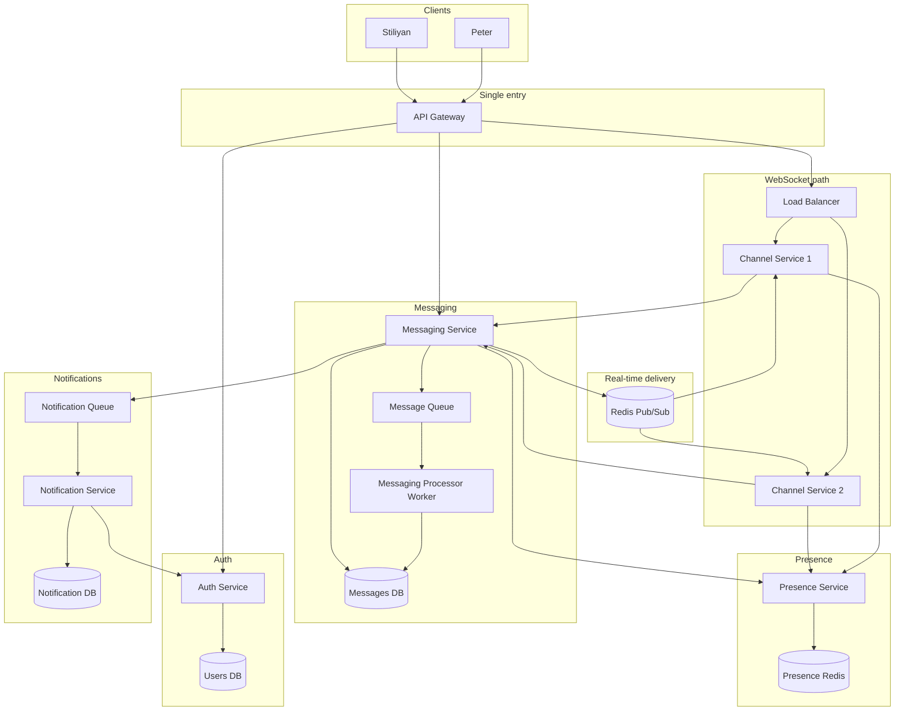
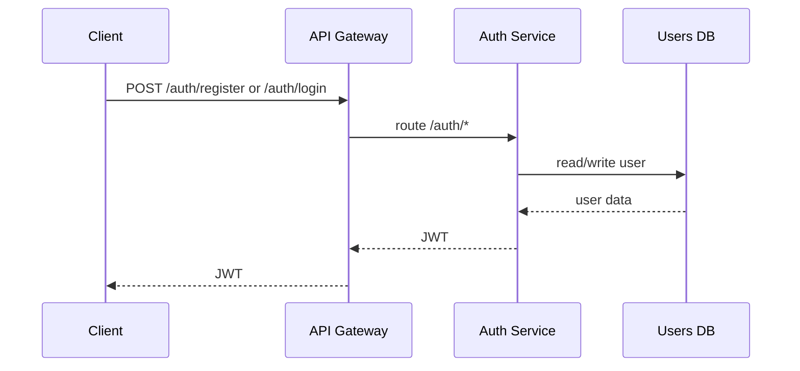
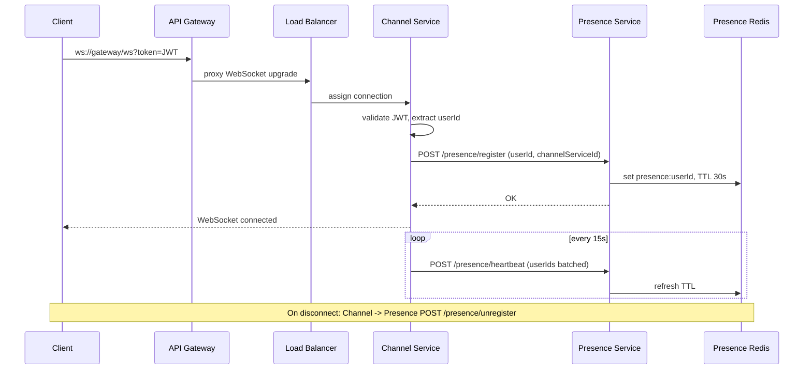
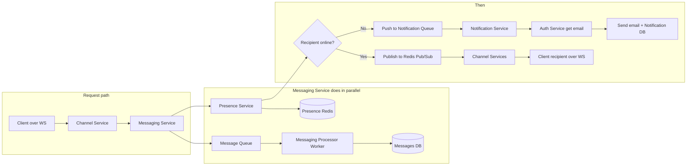
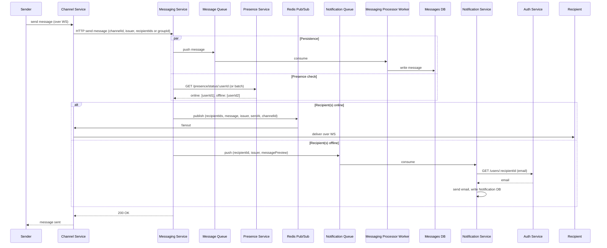
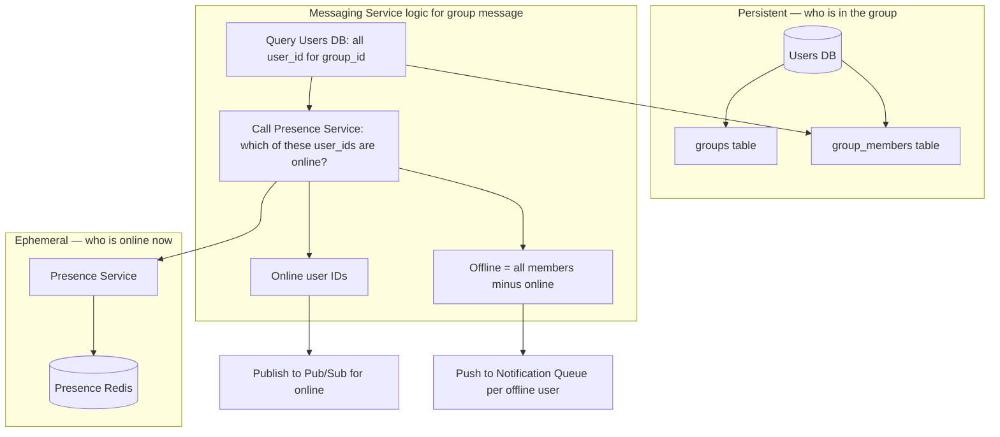
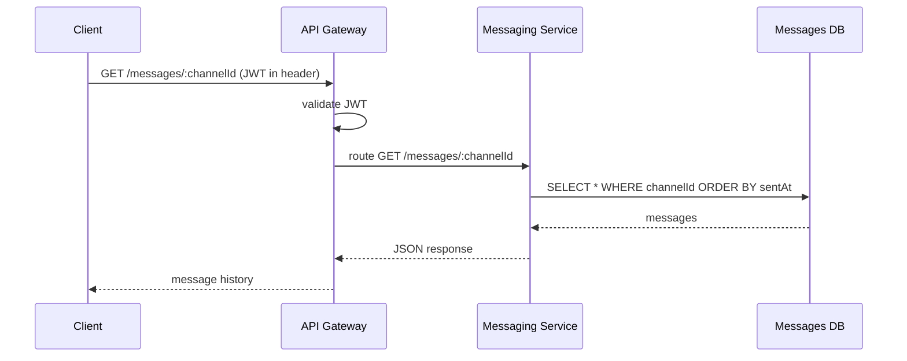
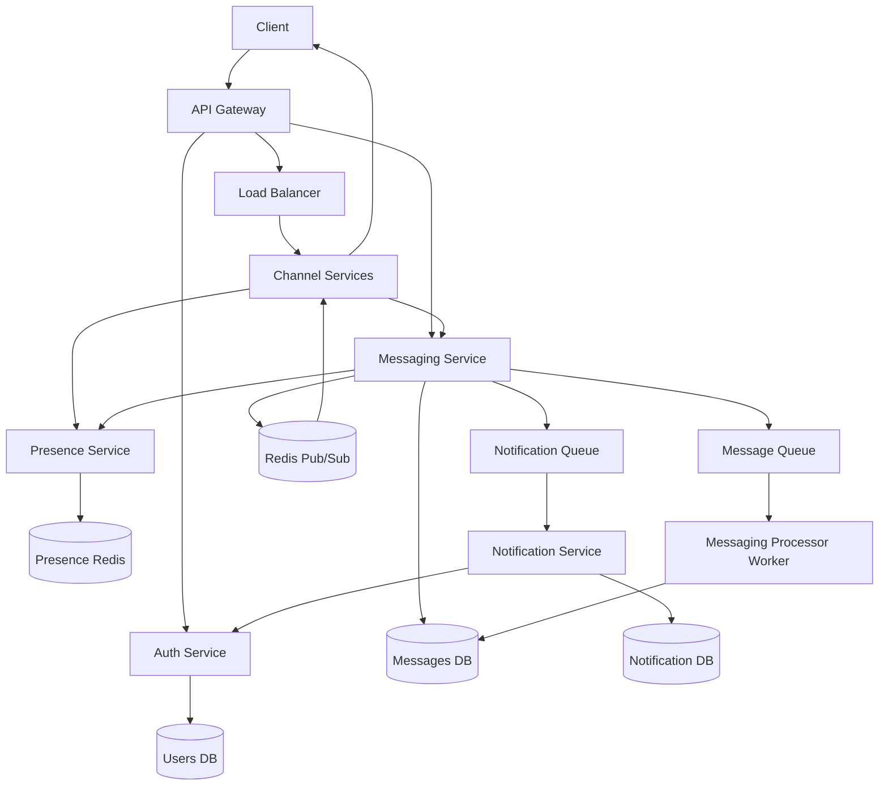

# Distributed Chat Application — Architecture Diagrams

## 1. High-level component view

---

## 2. Authentication flow

---

## 3. WebSocket connection and presence registration

---

## 4. Send message flow (one-to-one or group)

---

## 5. Send message — sequence (online vs offline)

---

## 6. Group: resolve members and offline users

---

## 7. Message history (read path)

---

## 8. Data stores summary

| Store              | Purpose                                          | Persistent?   | Who writes                 | Who reads                         |
| ------------------ | ------------------------------------------------ | ------------- | -------------------------- | --------------------------------- |
| Users DB           | Users, credentials, email, groups, group_members | Yes (volume)  | Auth Service               | Auth, Notification (via Auth)     |
| Messages DB        | All messages, channel history                    | Yes (volume)  | Messaging Processor Worker | Messaging Service (history)       |
| Notification DB    | Notification records, delivery status            | Yes (volume)  | Notification Service       | Notification Service              |
| Presence Redis     | Online status, channelServiceId per user         | No            | Presence Service           | Presence Service (Messaging asks) |
| Redis Pub/Sub      | Fan-out messages to Channel Services             | No            | Messaging Service          | Channel Services                  |
| Message Queue      | Async persistence buffer                         | No (or Redis) | Messaging Service          | Messaging Processor Worker        |
| Notification Queue | Async offline notifications                      | No (or Redis) | Messaging Service          | Notification Service              |

---

## 9. End-to-end picture (all flows in one)

---

_Diagrams reflect: auth flow, WebSocket + presence, send message (persistence + presence + online/offline), group membership from Users DB and offline = all members minus online, history read path, and data stores._
